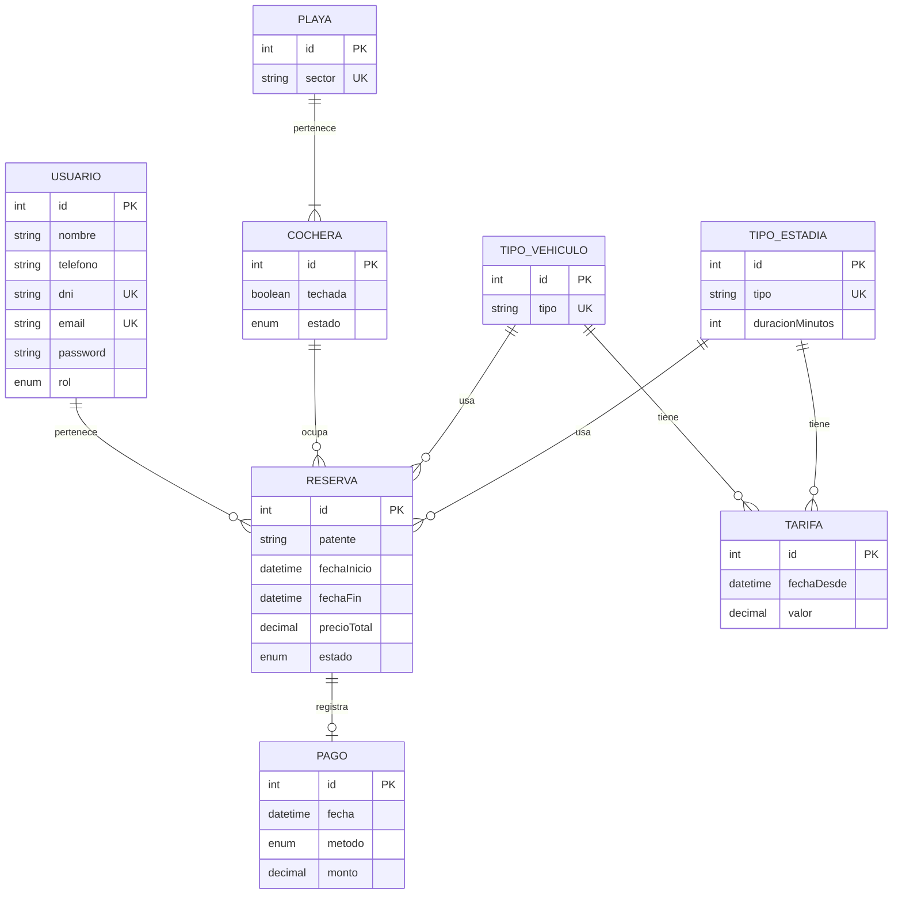

# Documentación: DSW API

Punto de entrada de la documentación del backend, según los requisitos de la cátedra.

| Sección                             | Estado                                                                    |
| ----------------------------------- | ------------------------------------------------------------------------- |
| Proposal actualizada                | Pendiente                                                                 |
| Links a los PR                      | Pendiente                                                                 |
| Instrucciones de instalación        | Ver [README principal](../README.md#instalación-y-ejecución-local-docker) |
| Minutas de reunión y avance         | Pendiente                                                                 |
| Tracking de features, bugs e issues | Pendiente                                                                 |
| Documentación de la API             | Pendiente                                                                 |
| Evidencia de ejecución de tests     | Pendiente                                                                 |

## Modelo de datos

DER corregido por la cátedra. Diferencias en la implementación:

- `Usuario.rol` (`ADMIN` | `CLIENTE`): necesario para los 2 niveles de acceso.
- `TipoEstadia.duracionMinutos`: necesario para calcular el precio total de la reserva.
- `Usuario` - `Reserva` es 0..N del lado de la reserva (un administrador no tiene reservas).

